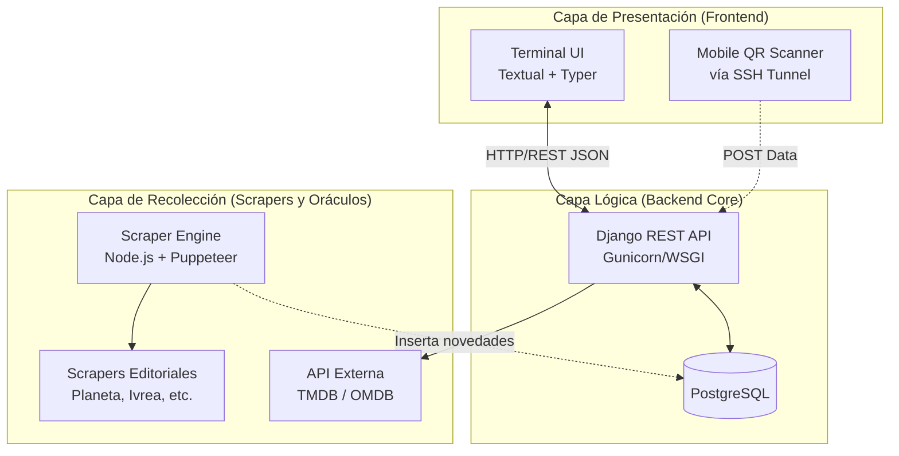
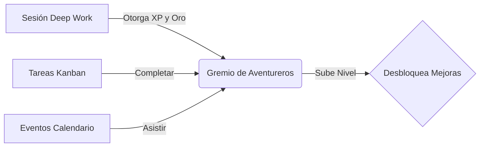
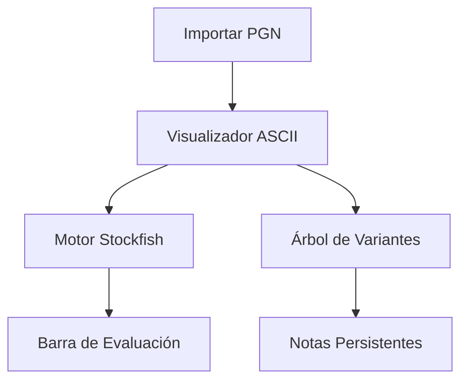

<div align="center">
  <h1>BUNKER</h1>
  <p><b>Centro de Operaciones de Vida en la Terminal</b></p>
  <p>Gestión de Inventario • Productividad RPG • Estudio de Ajedrez • Sistema Kanban</p>
</div>

---

**Bunker** es un ecosistema completo de microservicios diseñado para mejorar tu productividad y catalogar tus colecciones físicas desde la comodidad (y velocidad) de tu terminal. A través de una Interfaz de Usuario Textual (TUI) rica y asíncrona, conectada a un cerebro backend impulsado por Django, Bunker te permite catalogar colecciones físicas, organizar tu tiempo mediante metodologías RPG, analizar partidas de ajedrez y mucho más.

> **[PLACEHOLDER IMAGEN: DEMO GENERAL]**
> *(Captura sugerida: Un GIF navegando por las distintas pestañas de Bunker: Gremio, Kanban, Ajedrez, Libros, mostrando la fluidez de Textual).*

---

## Arquitectura Global del Sistema

Bunker no es un simple script, es una arquitectura orientada a servicios que separa la lógica de negocio, la recolección asíncrona de datos y la visualización.



---

## Stack Tecnológico

| Componente | Tecnologías |
| :--- | :--- |
| **Backend / API** | Python 3.12, Django, Django REST Framework |
| **Base de Datos** | PostgreSQL (Dockerizado) |
| **Interfaz de Terminal**| Textual (Framework TUI asíncrono), Typer, Plotext (para gráficos ASCII) |
| **Workers / Scrapers** | Node.js, Puppeteer (Web Scraping Headless) |
| **Infraestructura** | Docker, Docker Compose, Bash Scripting |

---

## Módulos Principales

### 1. La Posada (Motor RPG y Productividad)
El corazón de Bunker. Un sistema de productividad gamificado diseñado para premiar la constancia y castigar la pereza. Cada acción en Bunker impacta el progreso de tu "Gremio".



- **Gestión de Gremio:** Recluta avatares, mejora sus estadísticas (Fuerza, Inteligencia, etc.) en sesiones de trabajo y administra el prestigio del Gremio.
- **Sala de Enfoque (Timer):** Un reloj Pomodoro / Deep Work que genera eventos narrativos estilo MUD mientras trabajas.
- **Kanban y Calendario:** Tableros dinámicos (hasta 4 columnas personalizables) y agenda interactiva. Mover tareas a la columna final otorga prestigio automáticamente.
- **Tracker de Hábitos (Gráficos Infinitos):** Mide cualquier métrica (horas de lectura, sueño, visitas al gimnasio) renderizando gráficos de líneas y barras 100% en ASCII dentro de la terminal.

> **[PLACEHOLDER IMAGEN: LA POSADA - GRÁFICOS]**
> *(Captura sugerida: La pestaña "Rutinas" mostrando un gráfico de Plotext dibujado con caracteres braille, junto con la lista de hábitos diarios).*

> **[PLACEHOLDER IMAGEN: LA POSADA - KANBAN]**
> *(Captura sugerida: La pestaña "Kanban" mostrando las columnas de tareas y el calendario de eventos en la parte inferior).*

---

### 2. Estudio de Ajedrez (Chess Study)
Herramienta analítica para el jugador que busca mejorar, integrada sin salir de la terminal.



- **Motor Interno:** Juega y analiza posiciones gracias a la integración en tiempo real con Stockfish.
- **Árbol de Variantes Infinito:** Guarda líneas principales y bifurcaciones (sub-variantes) de tus partidas para explorar diferentes posibilidades estratégicas.
- **Toma de Notas Contextual:** Escribe recordatorios persistentes para posiciones específicas en el tablero.

> **[PLACEHOLDER IMAGEN: ESTUDIO DE AJEDREZ]**
> *(Captura sugerida: El tablero de ajedrez renderizado en ASCII, la barra de evaluación de Stockfish calculando ventaja, y el árbol de variantes a la derecha).*

---

### 3. Biblioteca y Bóveda (Inventario Físico)
Gestión para coleccionistas del formato físico (Libros, Blu-rays, 4K, DVDs).

- **Tracking Absoluto:** Control exacto de tu inventario, registro de préstamos a amigos y *Wishlists*.
- **Integración de Metadatos:** Conexión directa a The Movie Database (TMDB) y APIs de libros para autocompletar portadas, sinopsis y directores.
- **Escáner Móvil Asíncrono:** Levanta un túnel de red que renderiza un código QR en tu terminal. Lo escaneas con tu móvil y usas la cámara del celular como lector de códigos de barras (ISBN/UPC) para ingresar ítems a Bunker en tiempo real.

> **[PLACEHOLDER IMAGEN: INVENTARIO]**
> *(Captura sugerida: La Data Table de películas o libros, mostrando filtros y metadatos detallados).*

> **[PLACEHOLDER IMAGEN: ESCÁNER QR]**
> *(Captura sugerida: El modal en la terminal mostrando un código QR gigante en blanco y negro).*

---

### 4. El Oráculo (Scraper de Novedades)
Un demonio de Node.js que vive en segundo plano. Monitorea sitios de editoriales (Buscalibre, Planeta, Ivrea, etc.) y te notifica automáticamente en tu base de datos cuando un libro o manga de tu lista de deseos está en stock o en preventa.

---

## Guía de Instalación y Despliegue

Bunker está diseñado para instalarse en cualquier entorno UNIX (Linux/macOS). El backend se ejecuta herméticamente en Docker, mientras que el cliente de terminal (TUI) corre nativamente para máxima fluidez.

### Requisitos Previos
- [Python 3.10+](https://www.python.org/downloads/)
- [Docker](https://docs.docker.com/get-docker/) y [Docker Compose](https://docs.docker.com/compose/install/)
- Clave API gratuita de [TMDB](https://developer.themoviedb.org/docs/getting-started)

### Paso 1: Clonar y Configurar
Descarga el código y prepara tus variables de entorno.
```bash
git clone https://github.com/RicketyMajor/bunker.git
cd bunker
touch .env
```
Añade dentro del `.env` tu clave de API de TMDB:
```ini
TMDB_API_KEY=tu_clave_aqui
```

### Paso 2: Levantar el Servidor (Backend)
Bunker utiliza Docker para levantar PostgreSQL y el servidor Django sin ensuciar tu sistema operativo.
```bash
docker-compose up -d --build
```
*Verifica que los contenedores estén corriendo:* `docker ps`.

### Paso 3: Migraciones y Creación de Usuario
Prepara las tablas de la base de datos y crea tu usuario administrador:
```bash
docker-compose exec web python manage.py migrate
docker-compose exec web python manage.py createsuperuser
```

### Paso 4: Instalar el Cliente de Terminal (TUI)
Para no romper las dependencias de tu sistema (PEP 668), Bunker TUI se instala en un entorno virtual aislado `.venv`. Hemos preparado un script que automatiza todo:
```bash
chmod +x install.sh
./install.sh
```

---

## 🎮 Uso del Sistema

La herramienta de línea de comandos principal de Bunker se denomina `bunker`. 
Para usarla, **siempre debes activar primero el entorno virtual**:

```bash
# Estando en el directorio del proyecto
source .venv/bin/activate
```

### Comandos Principales

- **`bunker enter`**: Lanza la interfaz gráfica de terminal (TUI). Es el comando principal que usarás el 99% del tiempo para acceder a La Posada, el Ajedrez, etc.

*(Tip: Puedes crear un alias en tu `.bashrc` o `.zshrc` para entrar a Bunker desde cualquier parte)*:
```bash
alias bunker-os="cd ~/ruta/a/bunker && source .venv/bin/activate && bunker enter"
```
