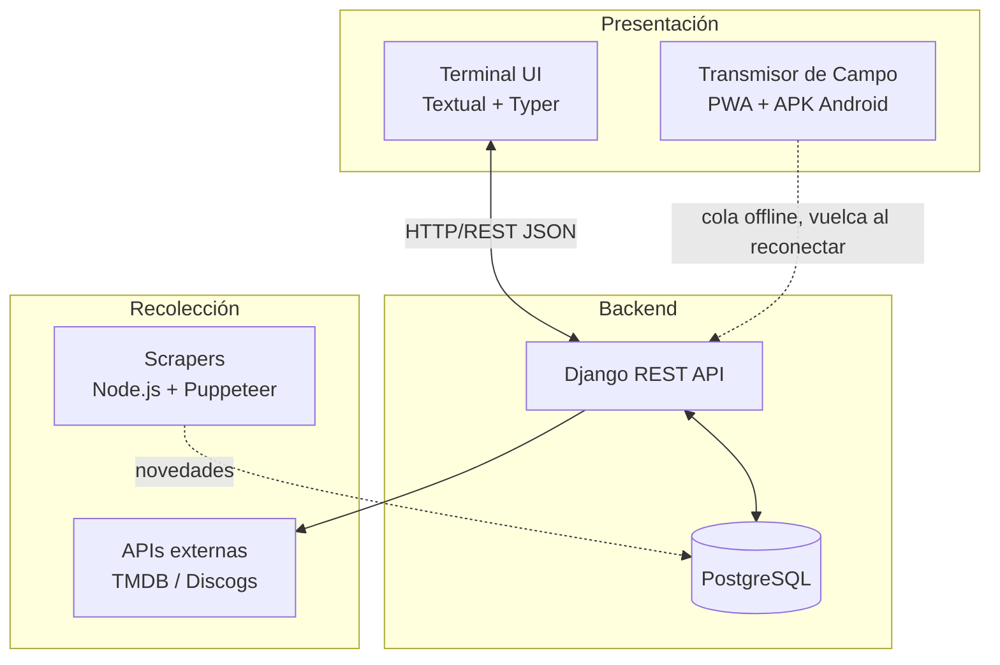

<div align="center">
  <h1>BUNKER</h1>
  <p><b>Inventario de una colección física, en la terminal</b></p>
  <p>Biblioteca • Videoclub • Disquera</p>
</div>

---

**Bunker** cataloga una colección física de libros, películas y discos desde la terminal. Una
Interfaz de Usuario Textual (TUI) asíncrona sobre una API Django + PostgreSQL en Docker, con una
bandada de scrapers que vigilan novedades y un acompañante móvil offline para capturar sin estar
delante del portátil.

> **Hasta el 2026-08-27 Bunker llevaba además un motor RPG de productividad y un laboratorio de
> ajedrez.** Son dos repositorios aparte desde entonces —`~/dev/posada` y `~/dev/ajedrez`— con su
> propia base de datos y su propio puerto. Este repositorio no puede alcanzarlos, y eso es
> deliberado.

---

## Arquitectura


```mermaid
graph TD
    subgraph "Presentación"
        TUI[Terminal UI<br/>Textual + Typer]
        MOVIL[Transmisor de Campo<br/>PWA + APK Android]
    end

    subgraph "Backend"
        API[Django REST API]
        DB[(PostgreSQL)]
        API <--> DB
    end

    subgraph "Recolección"
        Node[Scrapers<br/>Node.js + Puppeteer]
        TMDB[APIs externas<br/>TMDB / Discogs]
    end

    TUI <--> |HTTP/REST JSON| API
    MOVIL -.-> |cola offline, vuelca al reconectar| API
    Node -.-> |novedades| DB
    API --> TMDB
```

Los tres contenedores escuchan **sólo en `127.0.0.1`**: el acceso desde fuera va por
`tailscale serve`, que es lo que hace que la API no necesite autenticar 50 endpoints uno a uno.

---

## Stack

| Componente | Tecnologías |
| :--- | :--- |
| **Backend / API** | Python 3.12, Django 6, Django REST Framework |
| **Base de Datos** | PostgreSQL (Dockerizado) |
| **Interfaz de Terminal** | Textual, Typer, Plotext (gráficos ASCII) |
| **Móvil** | PWA con esbuild + APK Android (Kotlin, WorkManager) |
| **Workers / Scrapers** | Node.js, Puppeteer |
| **Infraestructura** | Docker, Docker Compose, Tailscale |

---

## Módulos

### 1. Biblioteca, Videoclub y Disquera (inventario físico)

Gestión para coleccionistas del formato físico: libros, Blu-rays, 4K, DVDs, vinilos, CDs y casetes.

- **Inventario y préstamos.** Control exacto de lo que tienes, a quién se lo prestaste y qué te
  falta (*wishlists*).
- **Metadatos automáticos.** TMDB para cine, Discogs para música, APIs de libros para portadas,
  sinopsis y autores.
- **Escáner móvil.** Levanta un túnel y dibuja un QR en la terminal; lo escaneas y usas la cámara
  del teléfono como lector de códigos de barras (ISBN/UPC).
- **Registro anual.** Lo que terminaste, mes a mes, con gráficos en ASCII dentro de la terminal.

### 2. Transmisor de Campo (captura offline)

Un acompañante móvil que **funciona sin red**. La cola vive en SQLite nativo y la vuelca
`WorkManager` con la aplicación cerrada; el respaldo sobrevive a una desinstalación. En `/panel/`
la misma superficie sirve para consultar en vez de capturar.

### 3. El Oráculo (scrapers de novedades)

Tres demonios de Node.js en segundo plano. Vigilan editoriales y sellos (Buscalibre, Planeta, Ivrea,
Discogs…) y anotan en la base cuando algo de tu lista entra en stock o preventa.

### 4. Bunker Core

La capa transversal: el BFF del panel, el parte diario, la revisión semanal, el health check y el
respaldo.

---

## Instalación

Backend en Docker, cliente de terminal nativo.

### Requisitos

- Python 3.10+ · [Docker](https://docs.docker.com/get-docker/) y Docker Compose
- Clave gratuita de [TMDB](https://developer.themoviedb.org/docs/getting-started)

### Paso 1 — Clonar y configurar el entorno

```bash
git clone https://github.com/RicketyMajor/bunker.git
cd bunker
cp .env.example .env
```

**Edita `.env` antes de seguir. Tres variables no tienen valor por defecto y el arranque falla
en voz alta sin ellas** — a propósito: las que había antes están publicadas en este repositorio.

```ini
DJANGO_SECRET_KEY=     # genérala, ver el comentario en .env.example
POSTGRES_PASSWORD=     # la tuya; vacía hace fallar a docker compose, que es lo que se quiere
TMDB_API_KEY=          # tu clave
```

Genera la `SECRET_KEY` con:

```bash
python -c "import secrets,string; print(''.join(secrets.choice(string.ascii_letters+string.digits) for _ in range(50)))"
```

### Paso 2 — Levantar el backend

```bash
docker compose up -d --build
docker ps
```

### Paso 3 — Migraciones y usuario

```bash
docker compose exec web python manage.py migrate
docker compose exec web python manage.py createsuperuser
```

### Paso 4 — Instalar la TUI

Se instala en un `.venv` aislado para no romper las dependencias del sistema (PEP 668):

```bash
chmod +x install.sh
./install.sh
```

---

## Uso

```bash
source .venv/bin/activate
bunker enter     # la TUI
bunker doctor    # 12 checks + API + Transmisor + Android + migraciones
```

`bunker doctor` es la compuerta: si sale verde, la pila está sana. Córrelo antes de dar por buena
cualquier sesión de trabajo.

*(Alias sugerido en tu `.bashrc`)*:

```bash
alias bunker-os="cd ~/ruta/a/bunker && source .venv/bin/activate && bunker enter"
```

---

## Respaldo

Dos mecanismos independientes, a propósito:

- Un `cron` dentro de la imagen, a las **00:00**, que vuelca al volumen `bunker_backups_data`.
- Un timer de systemd en el host, a las **00:30** (`scripts/respaldo_pilas.sh`), que vuelca las
  **tres** pilas a `~/dev/respaldos/` y rota las 7 últimas.

Un volumen podado y un disco muerto son accidentes distintos.
