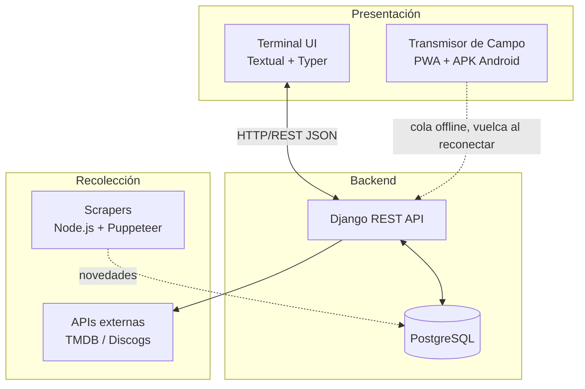

<div align="center">
  <h1>BUNKER</h1>
  <p><b>Inventario de una colección física, en la terminal</b></p>
  <p>Biblioteca • Videoclub • Disquera</p>
</div>

---

**Bunker** cataloga una colección física de libros, películas y discos desde la terminal. Una
Interfaz de Usuario Textual (TUI) asíncrona sobre una API Django + PostgreSQL en Docker, con una
bandada de scrapers que vigilan novedades y un acompañante móvil offline para capturar sin estar
delante del portátil.

> **Hasta el 2026-08-27 Bunker llevaba además un motor RPG de productividad y un laboratorio de
> ajedrez.** Son dos repositorios aparte desde entonces —`~/dev/posada` y `~/dev/ajedrez`— con su
> propia base de datos y su propio puerto. Este repositorio no puede alcanzarlos, y eso es
> deliberado.

---

## Arquitectura


```mermaid
graph TD
    subgraph "Presentación"
        TUI[Terminal UI<br/>Textual + Typer]
        MOVIL[Transmisor de Campo<br/>PWA + APK Android]
    end

    subgraph "Backend"
        API[Django REST API]
        DB[(PostgreSQL)]
        API <--> DB
    end

    subgraph "Recolección"
        Node[Scrapers<br/>Node.js + Puppeteer]
        TMDB[APIs externas<br/>TMDB / Discogs]
    end

    TUI <--> |HTTP/REST JSON| API
    MOVIL -.-> |cola offline, vuelca al reconectar| API
    Node -.-> |novedades| DB
    API --> TMDB
```

Los tres contenedores escuchan **sólo en `127.0.0.1`**: el acceso desde fuera va por
`tailscale serve`, que es lo que hace que la API no necesite autenticar 50 endpoints uno a uno.

---

## Stack

| Componente | Tecnologías |
| :--- | :--- |
| **Backend / API** | Python 3.12, Django 6, Django REST Framework |
| **Base de Datos** | PostgreSQL (Dockerizado) |
| **Interfaz de Terminal** | Textual, Typer, Plotext (gráficos ASCII) |
| **Móvil** | PWA con esbuild + APK Android (Kotlin, WorkManager) |
| **Workers / Scrapers** | Node.js, Puppeteer |
| **Infraestructura** | Docker, Docker Compose, Tailscale |

---

## Módulos

### 1. Biblioteca, Videoclub y Disquera (inventario físico)

Gestión para coleccionistas del formato físico: libros, Blu-rays, 4K, DVDs, vinilos, CDs y casetes.

- **Inventario y préstamos.** Control exacto de lo que tienes, a quién se lo prestaste y qué te
  falta (*wishlists*).
- **Metadatos automáticos.** TMDB para cine, Discogs para música, APIs de libros para portadas,
  sinopsis y autores.
- **Escáner móvil.** Levanta un túnel y dibuja un QR en la terminal; lo escaneas y usas la cámara
  del teléfono como lector de códigos de barras (ISBN/UPC).
- **Registro anual.** Lo que terminaste, mes a mes, con gráficos en ASCII dentro de la terminal.

### 2. Transmisor de Campo (captura offline)

Un acompañante móvil que **funciona sin red**. La cola vive en SQLite nativo y la vuelca
`WorkManager` con la aplicación cerrada; el respaldo sobrevive a una desinstalación. En `/panel/`
la misma superficie sirve para consultar en vez de capturar.

### 3. El Oráculo (scrapers de novedades)

Tres demonios de Node.js en segundo plano. Vigilan editoriales y sellos (Buscalibre, Planeta, Ivrea,
Discogs…) y anotan en la base cuando algo de tu lista entra en stock o preventa.

### 4. Bunker Core

La capa transversal: el BFF del panel, el parte diario, la revisión semanal, el health check y el
respaldo.

---

## Instalación

Un instalador por sistema. **Ninguno de los dos necesita `sudo`**, y los dos generan los secretos
de *esa* instalación: nada del Búnker de otra persona sirve en el tuyo.

### Requisitos

- **Docker y Docker Compose (V2)** — y nada más de la parte de Node: el bundle del móvil se
  construye dentro de un contenedor, así que no hace falta instalar Node en la máquina.
- **Python 3.10+**
- Clave gratuita de [TMDB](https://developer.themoviedb.org/docs/getting-started) si quieres que
  el radar de cine funcione. El resto arranca sin ella.

### Instalar en Linux o macOS

```bash
git clone https://github.com/RicketyMajor/bunker.git
cd bunker
./install.sh                      # o ./install.sh <capsula.json> para restaurar de paso
```

Seis pasos, en este orden: **requisitos → entorno → secretos → levantar → migrar → restaurar.**

> **Edita `.env` después de instalar si quieres los radares.** `.env.example` trae *marcadores de
> posición* en las claves de API (`your_google_books_key_here` y compañía), y el código pregunta
> `if GOOGLE_BOOKS_KEY:` — un marcador es **verdadero**, así que el oráculo no cae a su rama
> simulada: llama a Google con una clave inválida. Déjalas **vacías** o pon las tuyas.
El de *secretos* genera `POSTGRES_PASSWORD`, `DJANGO_SECRET_KEY`, `BUNKER_BACKUP_TOKEN` y
`BUNKER_API_TOKEN` con `secrets`, y añade tu IP de LAN a `DJANGO_ALLOWED_HOSTS`.

Si `.env` ya existe **no se toca**: bórralo si quieres secretos nuevos.

Al terminar:

```bash
.venv/bin/bunker enter            # la TUI
.venv/bin/bunker doctor           # la compuerta; ella dice cuantas son
```

### Instalar en Windows

```powershell
git clone https://github.com/RicketyMajor/bunker.git
cd bunker
powershell -ExecutionPolicy Bypass -File .\install.ps1
```

Los mismos seis pasos, en el mismo orden — y eso no es una promesa, lo comprueba
`tests/test_instaladores.py`, que falla si los dos ficheros dejan de declarar los mismos pasos.

> **Lo que esa comprobación NO prueba: que la versión de PowerShell funcione.** Se escribió en
> una máquina Linux, donde no se puede ejecutar. La primera corrida real en Windows es su primera
> prueba de verdad.

### Llegar desde el móvil

El camino por defecto es la **LAN**: el puerto `8009` escucha en `0.0.0.0` y toda ruta bajo
`/api/` exige la cabecera `X-Bunker-Api-Token`.

1. Averigua la IP que el instalador ya escribió en `DJANGO_ALLOWED_HOSTS` (la imprime al acabar).
2. Abre `http://<esa-IP>:8009/movil/` en el navegador del teléfono, en la misma Wi-Fi.
3. La primera vez sale un diálogo pidiendo el token. Pégale el valor de `BUNKER_API_TOKEN`:

   ```bash
   grep '^BUNKER_API_TOKEN=' .env
   ```

   Vive en el `localStorage` de ese navegador. Django **no** lo inyecta en la página — si lo
   hiciera, cualquiera en la Wi-Fi que abriera `/movil/` se lo llevaría.

`/movil/` es la captura; `/panel/` es la consulta. Las dos cargan sin token a propósito: la página
tiene que poder pedírtelo.

**El APK no es distribuible.** Lleva `BUNKER_URL` *y* su token cocidos en el build
(`BuildConfig`), así que cada instalación necesita el suyo. Compílalo con:

```bash
cd android && BUNKER_API_TOKEN=$(grep '^BUNKER_API_TOKEN=' ../.env | cut -d= -f2) ./gradlew assembleDebug
```

Quien no compile, usa la PWA en `/movil/` desde el navegador: hace lo mismo salvo la cola nativa.

<details>
<summary>Opcional: llegar desde fuera de casa (Tailscale, o un QR efímero)</summary>

`tailscale serve` proxea desde `http://127.0.0.1:8009` y sigue funcionando igual que antes.

El escáner por QR efímero es lo único que aún necesita una llave SSH dedicada, y **el instalador
ya no la crea**. Eso no es sólo documentación: `cli/main.py` y `cli/tui/modals.py` la usan sin
comprobar que exista, así que en una instalación nueva el modal del escáner se queda colgado en
«Negociando túnel cifrado» sin decir por qué. Genérala a mano antes de usarlo:

```bash
ssh-keygen -t ed25519 -N "" -f ~/.ssh/library_cli_key
```

</details>

### `/admin/`, sólo mientras lo necesites

**No va montado.** Sin `BUNKER_ADMIN=1` en `.env`, `/admin/` responde **404 desde cualquier
sitio** — no existe la ruta. Para encenderlo:

```bash
echo 'BUNKER_ADMIN=1' >> .env
docker compose up -d web
docker compose exec web python manage.py createsuperuser   # sólo la primera vez
```

Y para apagarlo, quita la línea y vuelve a levantar `web`. **El valor tiene que ser exactamente
`1`**: `true` o `si` dejan el admin cerrado en silencio, y por eso `bunker doctor` dice en cada
corrida si está montado o no.

**Por qué está apagado por defecto.** `/admin/` no está bajo `/api/`, así que el guardia del token
no lo cubre, y el puerto es `0.0.0.0`: montado, sus 41 rutas quedan alcanzables desde la Wi-Fi
sobre HTTP plano y lo único que las separa de la colección es ese login. No se cierra con una
guardia por IP porque no la hay que funcione: con Docker publicando el puerto, el contenedor ve la
puerta de enlace del bridge para lo que entra por el loopback del host y la IP real para lo que
entra por la LAN, así que `REMOTE_ADDR` no distingue tu portátil de un vecino.

Enciéndelo para editar la lista de vigilados —es su única interfaz gráfica— y apágalo al terminar.
La TUI y la API no necesitan superusuario para nada.

## Uso

```bash
source .venv/bin/activate
bunker enter                      # la TUI
bunker doctor                     # la compuerta: suites + API + Transmisor + Android + migraciones
bunker export musica -f md        # una colección a Markdown, por la salida estándar
bunker export libros -f csv > libros.csv
```

`bunker doctor` es la compuerta: si sale verde, la pila está sana. Córrelo antes de dar por buena
cualquier sesión de trabajo. **Exporta `BUNKER_API_TOKEN` antes**, o su ✓ de Android puede venir de
una tarea que Gradle dio por *up-to-date* sin ejecutarla.

`bunker export` acepta `libros`, `cine` y `musica`, en `csv` o `md`. Escribe a la salida estándar
para que el destino lo elijas tú (`> fichero.csv`, `| less`). Las celdas que empiezan por `=`, `+`,
`-` o `@` salen con una comilla delante **sólo en el CSV**: son fórmulas para Excel, y los títulos
vienen de terceros (los oráculos de código de barras y las fichas raspadas).

Dentro de la TUI, **`ctrl+g`** vuelve al centro de mando desde cualquier pantalla. **No funciona
con un diálogo abierto** —Textual corta la cadena de atajos en el primer modal, y es deliberado:
un diálogo tiene una respuesta pendiente—. Ciérralo con Escape primero.

*(Alias sugerido en tu `.bashrc`)*:

```bash
alias bunker-os="cd ~/ruta/a/bunker && source .venv/bin/activate && bunker enter"
```

---

## Respaldo

Un timer de systemd en el host, a las **00:30** (`scripts/respaldo_pilas.sh`), que vuelca las
**tres** pilas a `~/dev/respaldos/` y rota las 7 últimas.

Lleva `Persistent=true`, y ése es el punto: **se pone al día al arrancar** si la máquina estaba
apagada a las 00:30. Hasta el 2026-08-29 había un segundo mecanismo —un `cron` dentro de la
imagen, a las 00:00— presentado aquí como independiente. No lo era en la práctica: no se pone al
día jamás, así que sólo disparaba las noches que el portátil velaba. **Produjo su última cápsula
el 22 de agosto y pasó siete noches en blanco sin que nada lo dijera.** Borrado, con
`bunker_crontab` y `scripts/backup.sh`.

Las cápsulas que dejó están en `~/dev/respaldos/bunker-historico/` desde el 2026-09-02, cuando se
retiró el volumen `bunker_backups_data`: nadie escribía en él **y nadie lo leía** —`/api/backups/`
no tenía un solo llamador—. Para cargar una:

```bash
docker compose cp <capsula>.json web:/tmp/c.json
docker compose exec -T web python manage.py loaddata --ignorenonexistent /tmp/c.json
```
